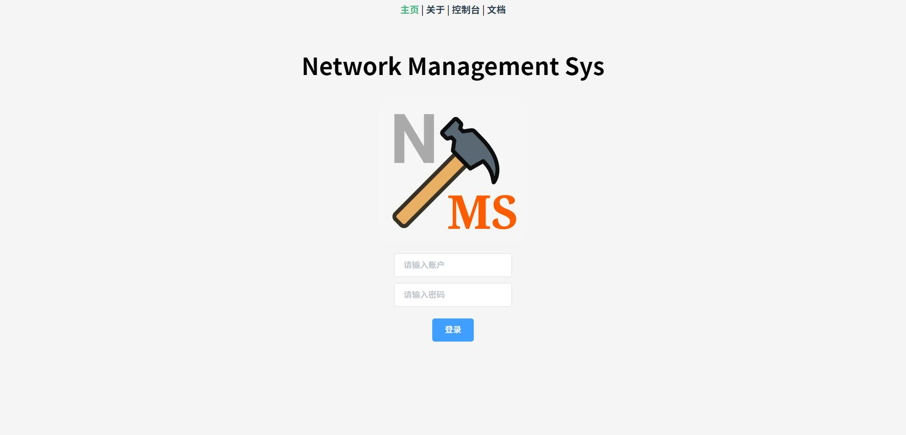
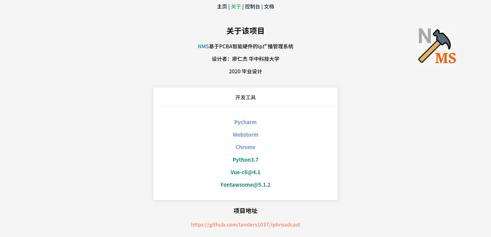
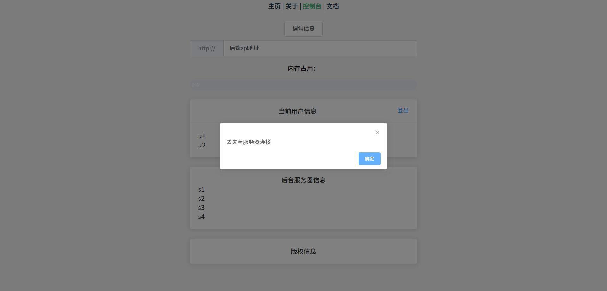
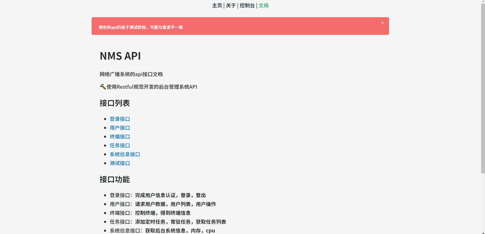
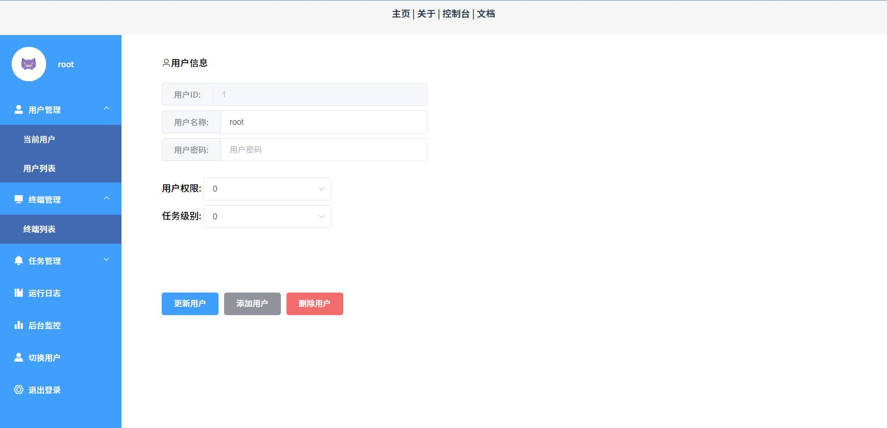
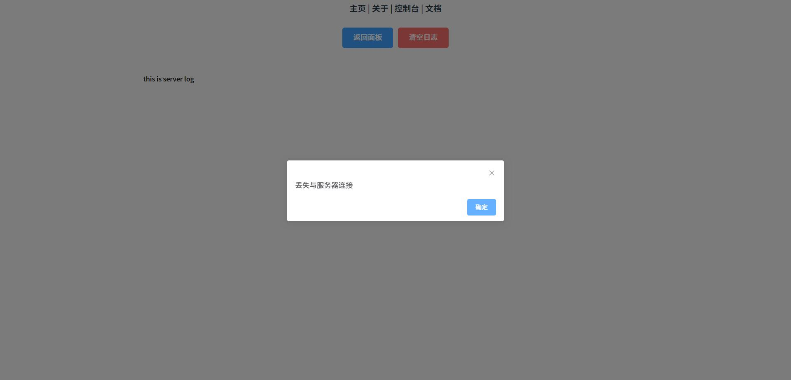
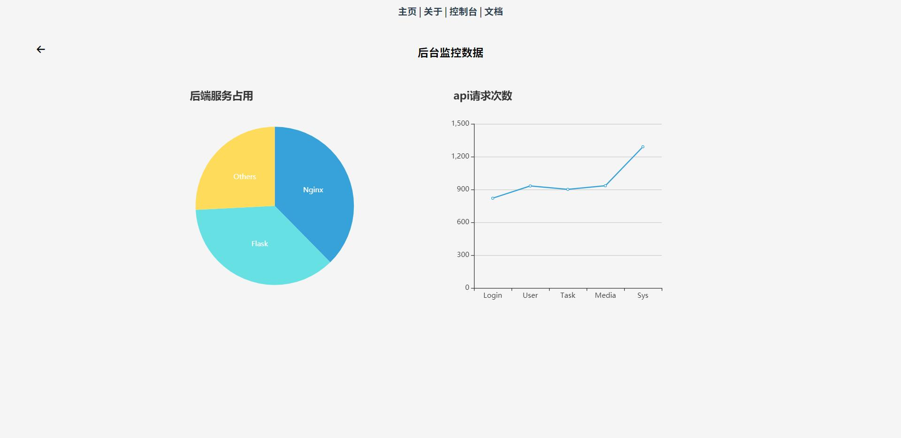

# nms
前后端分离式网络广播管理系统设计

[项目介绍](./intro.md)

## 依赖

1. Vue CLI@4.1.1
2. Python Flask
3. flask-httpauth,falsk-restful,falsk-sqlalchemy,functoools,psutil,psycopg2,flask-migrate,flask-scripts,flask-cors

## 版本

- v1.08
- v1.13
- v1.16
- v1.29

## 迭代信息

- ### v1.08

使用flask-restful构建基础api后端服务框架，使用requests库来请求硬件服务器的web服务，完成服务器后端和硬件后端的分离

- ### v1.13

使用vue-cli完成项目的构建，添加基本的登录页面，关于页面，控制台页面

~~使用flask-login进行用户的身份验证~~

在后期的测试中发现，flask-restful是无状态的api，不能保持请求时的用户状态所以不能使用flask-login

- ### v1.16

| 前端             | 后端          |
| ---------------- | ------------- |
| 添加登录页面验证 | cors跨域      |
| 添加控制台信息   | 设计token验证 |
| 添加API文档指引  | 重写restful   |
| 使用element美化  |               |

#### 登录认证

全局使用token请求头信息的方式完成验证，在前端使用axios发送登录请求数据，接收返回的json数据提取内部的token信息并保存在vuex内存中，每一次的请求发送时都会在请求头中添加token信息发送至后台验证。

修改axios拦截器在请求头上添加内存里存储的token信息。设置response里的401未授权响应直接跳转至登录页面。

后端：使用flask-httpauth的token验证装饰器，每次登录时生成token并设置token的过期时间。在收到api的请求时先验证身份再返回数据。

#### 控制台信息

前端：设计一个控制台用于查看后台的信息，主要查看后端的api地址，当前的登录用户状态，后端的硬件服务器状态，当前运行服务的内存cpu占用信息

后端：使用psutil获取系统的占用信息，从数据库获取当前的登录用户信息并返回

#### API文档

添加后端api的文档在线阅读页面，使用marked .js进行前端渲染

#### 美化

使用element UI的组件库进行页面的美化，实现页面的简单美观。同时使用部分自带的动画库进行过渡动画的渲染

- ### v1.29

重新设计了dashboard操作面板界面，布局更合理，菜单显示更清晰

添加了echarts绘制的后端服务监控信息和api请求次数统计

设计了生命周期更长的路由，用于返回时保存信息

添加了切换用户页面，可以再操作面板方便地切换用户

全局统一了配色样式

| 组件         | 配色     |
| ------------ | -------- |
| 主体色       | #f5f5f5  |
| 主题强调色   | #409eff  |
| 下拉菜单配色 | #426ab3  |
| 警告按钮     | #f56c6c  |
| 普通按钮     | \#909399 |

## 界面预览

登录页面

关于页面

控制台

在线文档

操作面板

运行日志

监控后台

