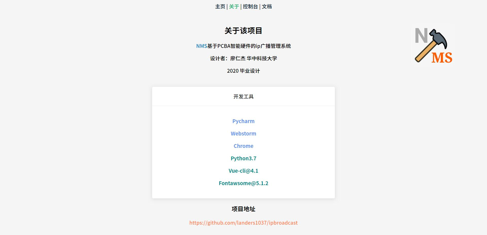
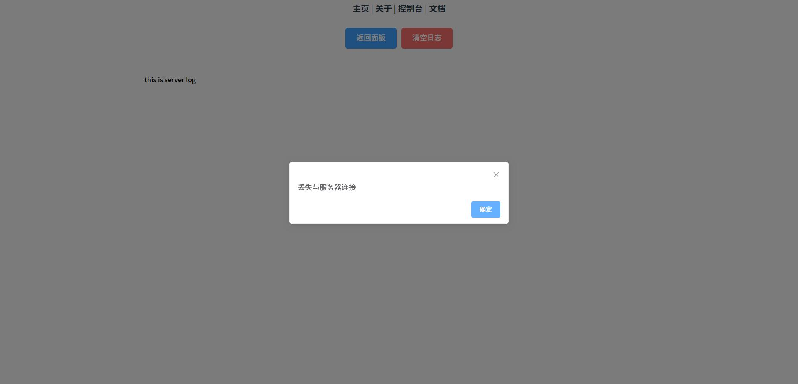
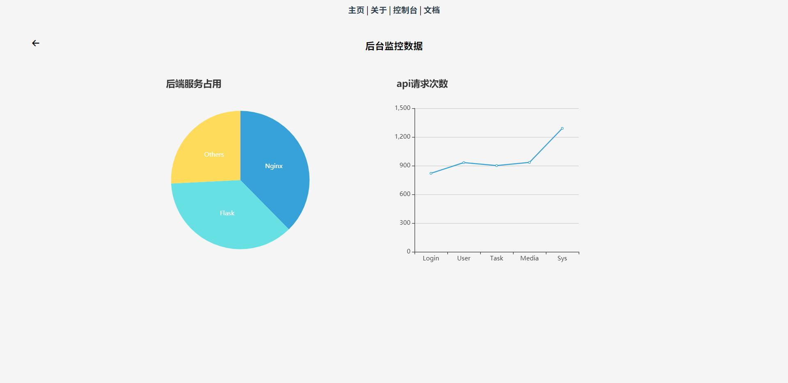

# NMS 设计进度

2020.2.4

前后端的框架基本设计完成

前端： vue+elementUI构建，使用axios请求数据

后端：flask的restful api，使用requests库请求硬件服务器

### 没做的部分：

- 用户权限的api设计，用户数据类型的变量有些解释不清，我还没弄懂什么意思
- 任务api设计，api文档简陋，部分变量没看懂什么意思，等待后期测试

### 目前实现功能

- 用户的正常登录登出
- 用户添加删除
- 服务器日志记录
- 服务器api请求统计
- 用户的切换

### 配置文件简介

后端使用`yaml`文件进行配置


部分配置没用暂时没删掉

在这里可以配置请求的后端地址，数据库地址，日志功能，用户token的失效时间，超级用户的名称和密码

### 界面预览与介绍

#### 主页


用户的登录页面，做了登录判断，如果登录为root（超级管理员）则后端直接会从yaml文件里读取root的单独配置，而不是从数据库读取，方便直接对超级用户的修改

#### 关于页



####  测试用的控制台页面


测试时使用，可以查看当前登录的用户和类型。后台系统占用，版权信息，后端请求api


#### 操作页面


vue父组件dashboard，每一个功能的操作面板均使用vue子组件，使用 `<component>`的方式加载进来。

父组件使用`keepalive`保证在操作时的状态保存

默认的操作面板是用户的操作

#### 功能-终端操作


 这是终端列表页面，在这里可以查看所有已联机的终端，并且删除和更新它们

#### 功能-任务


 这是任务的操作面板，你可以在这里查看全部任务列表，添加删除，更新任务

#### 日志



 日志页面，使用flask的装饰器定义的日志函数，在每个特定api请求到来时都会自动记录日志。

日志的格式如下

```c
[2020-02-04 12:07:15,707][17292][nms_log.py][DEBUG] --> 方式:api_logging@请求地址: http://127.0.0.1:5000/test/db
请求数据: "{\n\t\"user\": \"root\",\n\t\"pass\": \"MTIzNDU2\"\n}"
用户令牌: 890989808

[2020-02-04 12:07:16,470][14376][nms_log.py][DEBUG] --> 方式:api_logging@请求地址: http://127.0.0.1:5000/test/db
请求数据: "{\n\t\"user\": \"root\",\n\t\"pass\": \"MTIzNDU2\"\n}"
用户令牌: 890989808
```

 你可以在`yaml`配置文件里关闭日志

#### 统计



这是后台信息的统计，在部署到服务器后，会统计nginx，flask的后端占用。

api请求次数即所有的后端api请求统计


#### 文档


你可以点击**文档**按钮，在线查看后台使用flask设计的api文档，测试使用，上线后删除该部分


> 文档同步于Gitee和Github

[Gitee地址](https://gitee.com/lrjgood/ipbroadcast)

[Github地址](https://github.com/Landers1037/ipbroadcast)